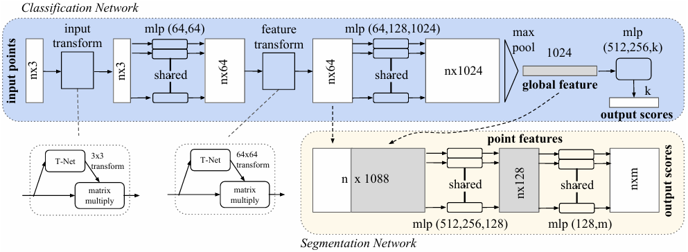
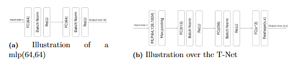
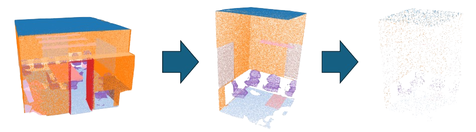
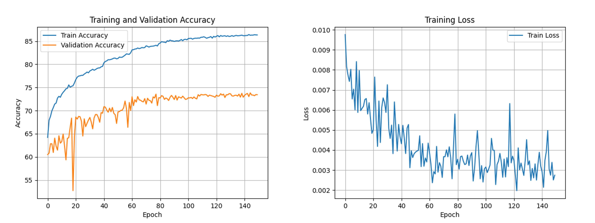
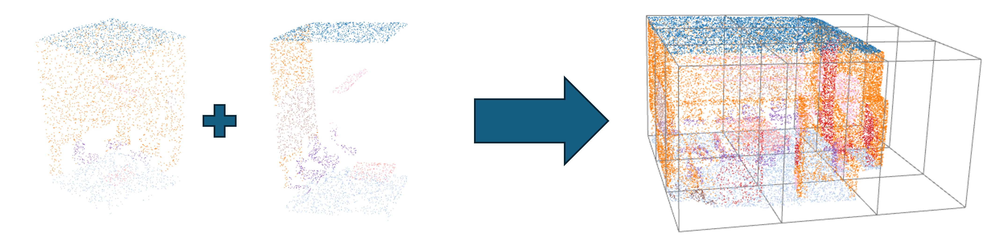

# PointNet-pytorch
A PyTorch implementation of the original [PointNet](https://arxiv.org/abs/1612.00593) architecture for 3D point cloud semantic segmentation, trained on the [Stanford Large-Scale 3D Indoor Spaces Dataset (S3DIS)](https://sdss.redivis.com/datasets/9q3m-9w5pa1a2h).

## Theory
PoinNet was one of the first deep learning methods for handling directly 3D point
cloud and receives unordered point sets as input, meaning the order of the points
does not matter. PointNet has two major parts, Classification Network and Seg-
mentation Network, allowing the model to both perform object classification and
semantic segmentation if needed. 

The model takes as input `n` points in 3D space, where each point is represented
by its coordinates ``(x, y, z)``. For segmentation tasks, the model outputs an ``n × m``
matrix, where each row is a one-hot encoded vector corresponding to the predicted
class label of each point. The classification network contain transformation networks
(T-Nets), multi layer perceptrons (MLP), and a maxpooling layer (maxpool).

The ``MLPs`` are small neural networks composed of fully connected layers with shared
weights, implemented as 1D convolutional layers with a kernel size of one (pytorch), followed
by a batch normalization and ReLU activation function. For example, the first
MLP(64,64) indicates that each point with a input of size three (corresponding to
the (x,y,z) coordinates) is passed through a hidden layer with 64 units, followed by
an output layer with 64 units.

The ``T-Nets`` are smaller networks with the goal of predicting an affine transformation
matrix and applying it to the input. The intuition behind transforming the input
data is as follows, what if the original coordinate system is not the most suitable for
representing the data? To address this, PointNet introduces the T-Net, a small neu-
ral network that learns a transformation matrix to map the input points into a more
optimal coordinate space. The T-Net architecture consists of an initial shared
MLP with layer sizes (64,128,1024), applied independently to each input point. This
is followed by a max-pooling layer to aggregate a global feature vector. The global
feature is then passed through two fully connected layers of sizes 512 and 256, each
followed by batch normalization and a ReLU activation function. Finally, a fully
connected layer outputs either 9 or 4096 values, depending on the input feature
dimension,which are reshaped into a transformation matrix of size 3 × 3 or 64 × 64.

## Dataset
 In this project the dataset ``Stanford Large-Scale 3D Indoor Spaces Dataset (S3DIS)`` is used to train the model to predict. It contains six large indoor areas, holding 272 rooms, recorded from three different buildings. Each point in a sample is represented by both its coordinates (x,y,z) and its corresponding (rgb) color and holds an annotation from one of 14 segmantic classes. 

 

 For this project, ``only the coorinates (x,y,z)`` has been used.  Each room in the dataset has been divided into 2 × 2 meter blocks along the x- and y-axes, extending fully along the z-axis. Since the model expects an input size of 4096 points, each training sample consist of 4096 randomly drawn points form a block. To improve generalization and robustness, data augmentation is applied to all training samples. This includes normalization, a random rotation around the z-axis, and the addition of Gaussian noise. 

## Training
The training algorithm used is Adaptive Moment Estimation (Adam optimizer), it utilise Stochastic gradient decent (SGD) together with momentum and RMSProp. Learning rate decay was used during training, with a multiplication factor [γ] of 0.5 was used and applied every 20 epochs, hence the learning rate gets halved every 20 epochs. During the training a batchsize [B] of 16 was used, regulated after the device which the training was performed on. The initialized learning rate [α] was set to 0.005 and was trained for 150 epochs. The final model was decided by taking the model during the training which had the ``best validation accuracy`` to avoid overfit-ting. 

 

 `Loss Function` used:

$$
\mathcal{L}_{\text{total}} = \mathcal{L}_{\text{cls}} + \frac{\alpha}{B} \sum_{i=1}^{B} \left( 
\left\| \mathbf{I}_3 - \mathbf{T}_{3 \times 3}^{(i)} \cdot \left( \mathbf{T}_{3 \times 3}^{(i)} \right)^\top \right\|_F 
+ 
\left\| \mathbf{I}_{64} - \mathbf{T}_{64 \times 64}^{(i)} \cdot \left( \mathbf{T}_{64 \times 64}^{(i)} \right)^\top \right\|_F 
\right)
$$
where $\mathcal{L}_{\text{cls}}$ is the negative log-likelihood classification loss, $\mathbf{T}_{3 \times 3}^{(i)}$ and $\mathbf{T}_{64 \times 64}^{(i)}$ are the transformation matrices predicted for the $i$-th sample in the batch. $\mathbf{I}_3$ and $\mathbf{I}_{64}$ are the identity matrices of size $3 \times 3$ and $64 \times 64$, respectively. $\| \cdot \|_F$ denotes the Frobenius norm. $B$ is the batch size, and $\alpha$ is a regularization weight.

## Result 

The final PointNet model reached a validation accuracy at ``73.83%`` on the S3DIS dataset, which highly demonstrates reasonable performance. For prediction a pointcloud using this model, the best way is to split it in same size blocks as the traing samples and predict each block and combine them. It is possible to predict directly on the wished pointcload but the performance may differ. 

 

##  Features

- Clean and modular PointNet architecture (as in Qi et al., 2017)
- Trained on the full S3DIS dataset for indoor scene understanding
- Support for data preprocessing, block-wise partitioning, and batch loading
- Easily extensible for classification or other datasets